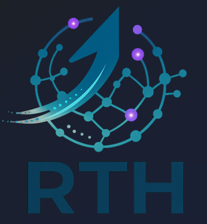

# 🌌 RTH-LM: A Fractal Temporal Convolutional Language Model

<p align="center">
  
</p>

**RTH-LM** is an experimental 25B parameter language model built on a **Fractal Gated Causal Temporal Convolutional Network (TCN)**. It is a strictly **non-Transformer** architecture designed for linear-time inference and extreme compute efficiency.

### 💎 Quantization & Efficiency
This repository includes the **2-bit quantized variant (`zeta25b_2bit.qulp`)**, demonstrating the architecture's extreme resilience to low-bit serialization. The 120B variant is projected to fit within a single 80GB GPU.

### 🚀 Key Technical Highlights
- **Architecture:** Fractal Gated Causal TCN (No-Attention).
- **Modularity:** Separated **Genome** (frozen core) and **Soul** (trainable adapters).
- **Efficiency:** Linear-time inference in sequence length; O(1) state memory during streaming.
- **2-bit Ready:** Designed for ultra-low precision quantization (evaluated 120B variant fits on a single 80GB GPU).

---

## 📄 Official Paper & Citation
The full technical paper is available on Figshare:
**[Read the Paper on Figshare](https://doi.org/10.6084/m9.figshare.31376560)** (DOI: 10.6084/m9.figshare.31376560)

```bibtex
@techreport{deluca2026rthlm,
  author = {De Luca, Christian Quintino},
  title = {RTH-LM: A Fractal Temporal Convolutional Language Model},
  institution = {RTH Italia (Research & Technology Hub)},
  year = {2026},
  url = {https://github.com/rthgit/ZetaGrid},
  doi = {10.6084/m9.figshare.31376560}
}
```

---

## 📈 Training Evidence
*   **Dataset:** 1.5GB curated scientific/narrative mix.
*   **Step:** 15,000
*   **Training Loss:** ≈ 1.0
*   **Perplexity:** ≈ 2.8
*   **Hardware:** Single NVIDIA A40 (24h loop).

---

## 🛠️ How to Run
RTH-LM uses a custom inference engine. You can run it using the provided `ZETAGRID_INFERENCE.py` script.

### 1. Requirements
```bash
pip install torch numpy
```

### 2. Loading the Model
```python
# Download the weights and Genome core
# zetagrid_25b_production.npy (7GB Genome)
# zeta25b_step15000.pt (Soul weights)

# Run interactive inference
python ZETAGRID_INFERENCE.py
```

---

## 📜 License
- **Research & Non-Commercial:** [CC BY-NC 4.0](https://creativecommons.org/licenses/by-nc/4.0/)
- **Commercial Use:** Requires a paid license from **RTH Italia**.
- **Contact:** [info@rthitalia.com](mailto:info@rthitalia.com)

---

## 🛰️ Roadmap & Vision
- **Scale:** Scaling to 120B and 1T variants.
- **Infinite Context:** Testing Genome-tiling for 256k+ sequence lengths.
- **Domain Specialization:** Release of specialized "Souls" for coding and legal analysis.

**Join the Discussion:** Head over to the [Community tab](https://huggingface.co/RthItalia/Rth-lm-25b/discussions) to share your feedback!
