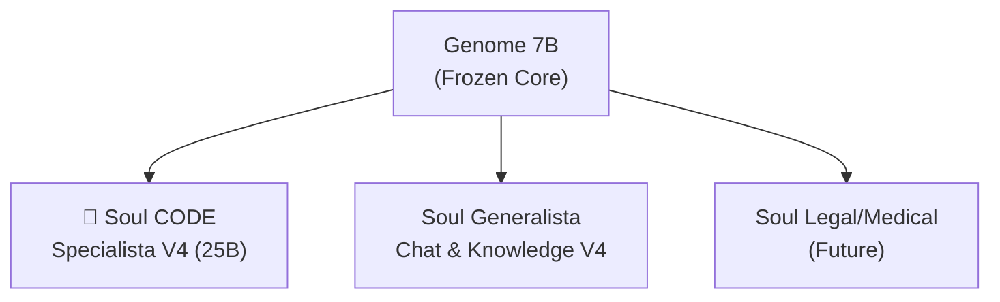

# 💻 RTH-Code 25B — Code Specialist Soul

> **"L'intelligenza è nell'architettura, non nelle GPU."**  
> Questa è la **Soul Specialista per il Codice** dell'ecosistema RTH-LM (V4 Architecture).
> Stesso Genome (7B) di base, ma con una "anima" addestrata per programmare (basata su V4 Expanded).

⚠️ **PROOF OF CONCEPT** ⚠️
Questa è una versione **BASE** creata per dimostrare l'efficienza scalare dell'architettura RTH-LM.
- **Tempo di Training:** Solo **8 ore** su singola A40.
- **Dataset:** Solo **5GB** di codice misto (Python, JS, C++, Go).
- **Obiettivo:** Dimostrare che un Genome congelato può apprendere skills verticali complesse in tempi record.

---

## ⚡ Che cos'è?

**RTH-Code 25B** non è un modello a sé stante. È una **Soul intercambiabile**.
Invece di scaricare un modello da 30GB per ogni task, mantieni il **Genome congelato (7B)** e cambi solo la Soul (**~3.8GB**).

Questa Soul è stata addestrata specificamente su:
- **Python** (Data Science, Backend, Torch)
- **JavaScript/TypeScript** (React, Node)
- **C/C++** (Systems programming)
- **Rust/Go**



Basta **swappare** i file `.pt` (o usare il GGUF unificato) e il tuo modello passa da "filosofo" a "senior engineer" in millisecondi.

---

## 📊 Specifiche Tecniche

| **Feature** | **Dettaglio** |
|---|---|
| **Architettura** | Fractal Gated Causal TCN (No Attention) - **V4 Enhanced** |
| **Parametri Totali** | **25B** (Genome + Soul V4 Expanded) |
| **Dimensione Soul** | **~3.8GB** (LoRA Rank 512, ~950M params) |
| **Dataset Training** | **5GB** (Misto: Python, JS, C++, Go) |
| **Tempo Training** | **8 ORE** (Singola Epoch) ⏱️ |
| **Contesto** | 2048+ (Teoricamente infinito grazie a TCN) |
| **Loss Finale** | **1.20** ✅ |
| **Hardware** | Addestrato su singola NVIDIA A40 (48GB) |

---

## 🛠️ Quickstart

### Opzione 1: GGUF (Consigliata per Ollama/llama.cpp)
Scarica `rth_lm_25b_code.gguf` da questo repo.

```bash
# Esegui con llama.cpp
./llama-cli -m rth_lm_25b_code.gguf -p "def fibonacci(n):" -n 200

# Oppure con Ollama (crea Modelfile)
# FROM ./rth_lm_25b_code.gguf
# SYSTEM "You are an expert coding assistant."
```

### Opzione 2: Python (Original PyTorch)
Se hai già il repo [ZetaGrid](https://github.com/rthgit/ZetaGrid):

```python
from ZETAGRID_INFERENCE import ZetaGrid25B

# Carica il Genome base
model = ZetaGrid25B("zetagrid_25b_production.npy")

# Inserisci la Soul del Codice
model.load_soul("zeta25b_code_FINAL.pt")

print(model.generate("def quicksort(arr):"))
```

---

## 🧪 Performance & Capability

RTH-Code eccelle in:
1. **Code Completion**: Autocompletamento intelligente di funzioni e classi.
2. **Refactoring**: Riscrittura di codice legacy in clean code.
3. **Docstrings**: Generazione automatica di documentazione.
4. **Unit Tests**: Scrittura di test `pytest`/`unittest`.

*Nota: Essendo un'architettura No-Attention (TCN), ha un overhead di inferenza bassissimo e scala linearmente O(N) con la lunghezza del contesto.*

---

## 📜 Licenza & Uso Commerciale ⚠️

> **ATTENZIONE: QUESTO MODELLO NON È OPEN SOURCE COMPLETO.**  
> È rilasciato sotto licenza **CC BY-NC 4.0 (Creative Commons Non-Commercial)**.

### ✅ Cosa PUOI fare (Gratis):
- Ricerca accademica e personale.
- Test e valutazione locale.
- Uso hobbyistico e no-profit.
- Condividere i risultati citando l'autore.

### ❌ Cosa NON PUOI fare (Senza Licenza Commerciale):
- **Usare il modello in azienda** per qualsiasi scopo (interno o esterno).
- Integrare il modello in prodotti o servizi a pagamento.
- Offrire API o servizi cloud basati su questo modello.
- Qualsiasi attività che generi revenue diretta o indiretta.

📞 **PER USO COMMERCIALE (Enterprise / Startup):**
Devi ottenere una licenza commerciale da **RTH Italia**.
Contatto diretto: [**info@rthitalia.com**](mailto:info@rthitalia.com)

---

## 📄 Citazione

Prodotto da **RTH Italia** (Research & Technology Hub).  
Autore: *Christian Quintino De Luca*.

Per citare il paper originale:
📖 **[RTH-LM: A Fractal Temporal Convolutional Language Model](https://doi.org/10.6084/m9.figshare.31376560)**  

```bibtex
@techreport{deluca2026rthlm,
  author      = {De Luca, Christian Quintino},
  title       = {RTH-LM: A Fractal Temporal Convolutional Language Model},
  institution = {RTH Italia (Research & Technology Hub)},
  year        = {2026},
  url         = {https://github.com/rthgit/ZetaGrid},
  doi         = {10.6084/m9.figshare.31376560},
  note        = {Non-commercial license. Contact RTH Italia for commercial use.}
}
```

---

*Costruito per dimostrare che l'efficienza batte la forza bruta.*  
**RTH Italia**
