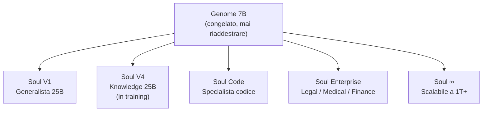

# 🌌 RTH-LM 25B — L'intelligenza è nell'architettura, non nelle GPU

> **Costruito in 24 ore da zero. Da una persona sola. Su una singola A40.**  
> Non per sfidare OpenAI. Per dimostrare che il paradigma è sbagliato.

---

## 🎮 Provalo SUBITO — Demo Live

👉 **[Gradio Demo — Parla con RTH-LM ora](https://huggingface.co/spaces/RthItalia/Rth-Lm-25b)**

---

## Il concetto che cambia tutto

La maggior parte dei modelli AI funziona così:
> *"Più parametri, più GPU, più soldi = modello migliore."*

RTH-LM dimostra il contrario.

**Un solo Genome congelato** (il "cervello base") può alimentare **infinite Souls** (adapter specializzati) senza mai riaddestrare il core. Lo stesso Genome da 7B può diventare 25B, 120B, o 1T+ semplicemente cambiando la Soul.

```
Genome (7B, congelato) ──┬── Soul Generalista  → 25B effective
                         ├── Soul Codice        → 25B code specialist  
                         ├── Soul Legale        → 25B enterprise legal
                         ├── Soul Medica        → 25B healthcare
                         └── Soul [∞]           → scalabile all'infinito
```

Per un'azienda: **un solo Genome enterprise** + Soul intercambiabili per ogni reparto. Zero riaddestramento del core. Swap in secondi.

---

## 🚀 Perché è diverso da tutto il resto

| Feature | Transformer classico | RTH-LM |
|---|---|---|
| **Architettura** | Attention O(N²) | TCN Causale O(N) lineare |
| **Contesto** | Limitato dalla VRAM | Teoricamente infinito |
| **Quantizzazione** | Degrada rapidamente | Resiliente fino a **2-bit** |
| **Modularity** | Monolitico | Genome + Soul separati |
| **Training** | Migliaia di GPU | **1 A40, 24 ore** |
| **Parametri trainabili** | Tutti | Solo Soul (~244M–950M) |

---

## 📈 Training Evidence (Aggiornato Feb 2026)

| Versione | Step | Loss | Dataset | Note |
|---|---|---|---|---|
| **V1** | 15,000 | 1.07 | 1.5GB curated | Baseline — `zeta25b_step15000.pt` |
| **V2 Repair** | 500 | 1.07 | 1.4GB SFT mix | Fine-tuning da V1 |
| **V3 Knowledge** | 5,000 | 1.33 | **9.1GB** (Wiki EN/IT, C4, Books) | Espansione conoscenza |
| **V4 Expanded** | 10,000 | **1.28** | 9.1GB | LoRA rank 512 (~950M trainabili) ✅ |
| **V5 Code** | 5,000 | In training | 4.5GB code | Code Specialist Soul 🔄 |

- Hardware: **NVIDIA A40 48GB** (singola GPU)
- Architettura: Fractal Gated Causal TCN, No-Attention
- Vocab: Byte-level (256 token) — zero tokenizer

---

## 🛠️ Quickstart

### Opzione 1: Python (più flessibile)

```bash
git clone https://github.com/rthgit/ZetaGrid
cd ZetaGrid
pip install torch numpy
python ZETAGRID_INFERENCE.py
```

### Opzione 2: Ollama (più facile)

```bash
ollama create rth-lm-25b -f Modelfile_RTH-LM
ollama run rth-lm-25b "Ciao, dimmi chi sei"
```

### Opzione 3: GGUF (compatibile llama.cpp)

```bash
# Scarica rth_lm_25b_v1.gguf (15.6 GB) o la variante 2-bit
./llama-cli -m rth_lm_25b_v1.gguf -p "The future of AI is"
```

---

## 💎 Quantizzazione & Efficienza

- **2-bit ready**: `zeta25b_2bit.qulp` — architettura progettata per resistere a quantizzazione estrema
- **120B su singola GPU**: la variante 120B è proiettata per stare in 80GB (2-bit)
- **Inferenza O(N)**: nessun collo di bottiglia attention — contesto lungo praticamente gratis

---

## 📄 Paper & Citazione

Paper completo disponibile su Figshare:  
📖 **[RTH-LM: A Fractal Temporal Convolutional Language Model](https://doi.org/10.6084/m9.figshare.31376560)**  
DOI: `10.6084/m9.figshare.31376560`

```bibtex
@techreport{deluca2026rthlm,
  author      = {De Luca, Christian Quintino},
  title       = {RTH-LM: A Fractal Temporal Convolutional Language Model},
  institution = {RTH Italia (Research & Technology Hub)},
  year        = {2026},
  url         = {https://github.com/rthgit/ZetaGrid},
  doi         = {10.6084/m9.figshare.31376560}
}
```

---

## 🛰️ Roadmap

- [x] V1: Genome + Soul baseline (15K step, loss 1.07)
- [x] V2: Fine-tuning repair
- [x] V3: Knowledge expansion (9.1GB dataset, Wiki EN/IT, C4, Books)
- [x] V4: LoRA rank 512 (~950M trainabili) — **loss 1.28, PPL 3.6** ✅
- [/] V5 Code: Code Specialist Soul (4.5GB code dataset) — **in training ora**
- [ ] GGUF v2: Conversione e upload del checkpoint V4
- [ ] Scaling 50B: Stesso Genome, Soul espansa a 64 layer
- [ ] Scaling 1T: Dimostrazione proof-of-concept

---

## 📜 Licenza

**CC BY-NC 4.0** — Ricerca e uso personale libero.  
Uso commerciale/enterprise → contatto diretto: **info@rthitalia.com**

---

## Schema Architetturale



---

*La prossima rivoluzione dell'AI non arriverà da chi ha più soldi o più GPU.*  
*Arriverà da chi capisce che **l'architettura è tutto**.*

*— Christian Quintino De Luca, RTH Italia*
