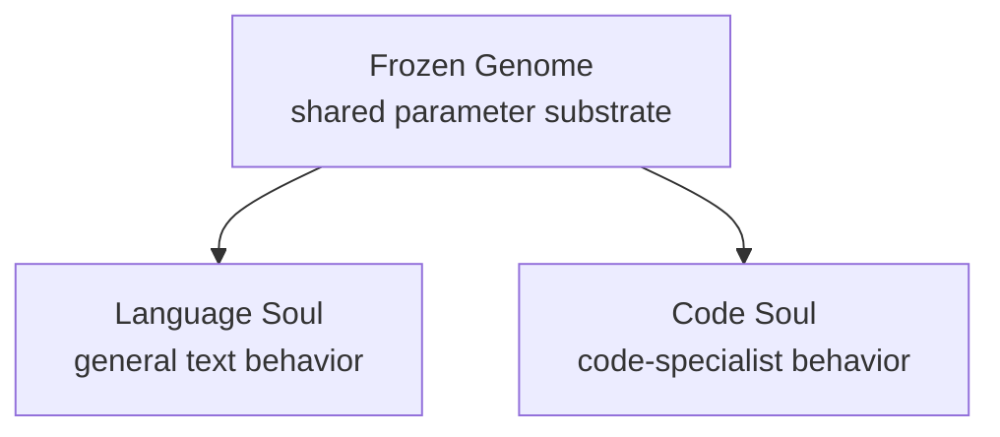

# RTH-Code 25B

RTH-Code 25B is an experimental code-specialist Soul for the RTH-LM / ZetaGrid architecture.

It is not a standalone Transformer model. It is part of the RTH-LM Genome/Soul system: a shared frozen Genome provides the reusable parameter substrate, while a smaller trainable Soul carries task specialization.

## Status

This is an early proof-of-concept research release. It is intended for architecture evaluation, local experimentation, and reproducibility work around non-Transformer language models.

Do not treat this release as a production coding assistant or as evidence of parity with frontier code models. The current release should be evaluated with fixed prompts, held-out code tasks, and reproducible benchmark harnesses before downstream use.

## Model Details

| Field | Value |
| --- | --- |
| Model name | RTH-Code 25B |
| Organization | RTH Italia |
| Author | Christian Quintino De Luca |
| Architecture | Fractal Gated Causal TCN (non-Transformer) |
| System design | Frozen Genome + trainable Soul adapters |
| Effective capacity | 25B class, via fractal capacity framing |
| Specialization | Code generation / code completion experiments |
| Training data | Mixed code corpus, including Python, JavaScript/TypeScript, C/C++, Rust, and Go |
| Training hardware | Single NVIDIA A40 class run |
| License | CC BY-NC 4.0 for research/non-commercial use; commercial license required |
| Paper | https://doi.org/10.6084/m9.figshare.31376560 |

## Intended Use

This release is intended for:

- Research on non-attention language-model architectures.
- Local experiments with the RTH-LM Genome/Soul design.
- Code-generation prompt tests under controlled evaluation settings.
- Comparison against Transformer and state-space baselines.
- Reproducibility work around quantization and low-memory inference paths.

This release is not intended for:

- Production software development without independent validation.
- Security-critical code generation.
- Commercial products, paid APIs, or enterprise internal use without a commercial license.
- Claims of benchmark superiority without published, reproducible benchmark evidence.

## Architecture Summary

RTH-Code 25B uses the same high-level ZetaGrid design as RTH-LM:

- A Fractal Gated Causal Temporal Convolutional Network backbone.
- No standard self-attention block.
- A frozen Genome weight bank reused across model variants.
- Trainable low-rank Soul adapters for specialization.
- Optional QULP-style quantization path for low-memory experiments.

The research hypothesis is that domain behavior can be changed by swapping the Soul while keeping the Genome stable. RTH-Code is the code-specialist demonstration of that idea.



## Files

Typical artifacts for this release may include:

| File | Role |
| --- | --- |
| `rth_lm_25b_code.gguf` | Unified GGUF artifact for local runtime experiments |
| `zeta25b_code_FINAL.pt` | Code-specialist Soul checkpoint |
| `zetagrid_25b_production.npy` | Shared Genome weight bank |
| `config.json` | Architecture metadata |
| `ZETAGRID_INFERENCE.py` | Reference Python inference script |

File availability may differ by release channel. Large artifacts are hosted on Hugging Face rather than in the GitHub source repository.

## Quickstart

### Python reference path

Download the required Genome and Code Soul artifacts, then run the repository inference script.

```python
from ZETAGRID_INFERENCE import ZetaGrid25B

model = ZetaGrid25B("zetagrid_25b_production.npy")
model.load_soul("zeta25b_code_FINAL.pt")

print(model.generate("def quicksort(arr):"))
```

The current reference code is research-oriented. You may need to adjust paths, device selection, and checkpoint loading for your environment.

### GGUF path

If a compatible runtime build is available for the RTH TCN operators:

```bash
./llama-cli -m rth_lm_25b_code.gguf -p "def fibonacci(n):" -n 200
```

Compatibility depends on runtime support for the custom RTH TCN architecture. Standard Transformer-only GGUF runners may not execute this architecture without additional kernels.

## Evaluation Notes

The strongest current evidence for this release is architectural and training-process evidence, not broad benchmark coverage. Before citing capability claims, run:

- Deterministic code-completion prompts.
- HumanEval or MBPP-style tasks, with exact pass@k settings.
- Syntax-validity checks.
- Repetition and invalid-token checks.
- Comparisons against small open code models under the same decoding settings.

Published benchmark results should include prompts, decoding parameters, commit hash, artifact hashes, and hardware.

## Limitations

- Early proof-of-concept model.
- Not instruction tuned to the level of mainstream coding assistants.
- Quality may vary strongly with decoding settings.
- Runtime support for custom non-Transformer GGUF artifacts may require patched kernels.
- Public claims should distinguish training loss, memory estimates, and actual task performance.

## License and Commercial Use

RTH-Code 25B is released under CC BY-NC 4.0 for research and non-commercial use.

Commercial use requires a separate license from RTH Italia. Commercial use includes paid products, hosted APIs, enterprise internal development, integration into commercial developer tools, and any revenue-generating deployment.

Contact: info@rthitalia.com

## Citation

```bibtex
@techreport{deluca2026rthlm,
  author      = {De Luca, Christian Quintino},
  title       = {RTH-LM: A Fractal Temporal Convolutional Language Model},
  institution = {RTH Italia (Research & Technology Hub)},
  year        = {2026},
  url         = {https://github.com/rthgit/ZetaGrid},
  doi         = {10.6084/m9.figshare.31376560},
  note        = {Non-commercial license. Contact RTH Italia for commercial use.}
}
```
